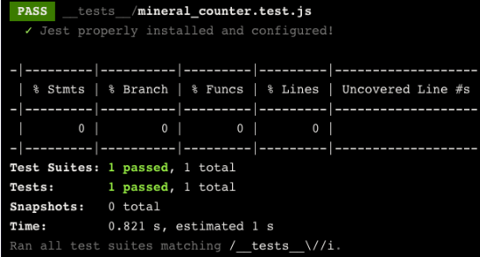

# Jest

#### What is Jest ?

Jest provides the two key ingredients needed for testing:

1. An assertion library: an API of functions for validating a program’s functionality
2. A test runner: a tool that executes tests and provides outputted test summaries


## Getting Started With Jest

Jest is the default test runner included and preconfigured in `create-react-app`. There is no further installation necessary when using `create-react-app` to build a new app!

To begin testing, we need to make sure that our test files are located, or match the following name conventions under the **/src** top-level directory:

- files with names ending in **.test.js**
- files with names ending in **.spec.js**
- **.js** files within a **__tests__/** directory

How we store test files in your project may depend on our specific needs. We may choose to colocate test files with the code being tested or to separate them into a **__tests__** directory.

File Structure usually recommended 


It is a good practice to match the name of the test file to the file that we want to test. For example, if we were to test a file called **math.js**, we might create a file called **math.test.js**.

Once we have our test files created , we can run the test using the npm command:

`npm test`

This will launch the test in *watch mode*, allowing the test to re-run every time the file is saved! We will need to type `q` in the terminal to quit out of the watch mode.

## Configuring Jest

Jest allows us to customize the terminal output using command-line flage , one of the most commonly used is the --coverage flag

`npm test -- --coverage`

Make sure to note the double dash between the `npm test` and `--coverage`. This is to separate the arguments from the test command itself. This `--coverage` flag allows us to get a report of which lines of our code were actually tested. In addition to being outputted in the terminal, this report becomes available in a directory named **coverage/** that is created at runtime.



This report can help us ensure our code has been thoroughly tested. From the report, we can see that there are four categories of our code that are being analyzed:

- **Statement** coverage analyzes the percentage of the program’s statements that have been executed.
- **Branch** coverage analyzes the percentage of the program’s edge cases that have been executed.
- **Function** coverage analyzes the percent of the program’s functions that have been called during testing.
- **Line** coverage analyzes the percentage of the program’s executable lines in the source file that have been executed.

## Unit Testing with Jest (Part 1)

A unit test is designed to test the smallest unit of your code, like a single function.

When unit testing, each function should be tested in isolation. We can do this by creating separate containers for our testing logic using the `it()` function or the `test()` function.

Functionally, `it()` and `test()` are the same. Using one over the other can make tests more readable. We should choose the one that organizationally makes sense in your project and use case.


```js
it("should render onto the screen",() => {});
test("should render onto the screen",() => {});
```

The `it()` function takes three arguments:

1. A string describing what is being tested.
2. A callback function containing assertions and other testing logic.
3. An optional timeout in milliseconds that specifies how long a test should wait before automatically aborting. If unspecified, this defaults to 5000 ms.

## Unit Testing with Jest(Part 2)

An assertion helps us define an expected outcome and check if the code meets these expectations

Jest helps us make assertions with the `expect()` function. It is used to assert the expected behavior of our program and is employed whenever we write a test. However, this function is rarely used alone — it can almost always be found in conjunction with *matcher methods* such as `.toBe()`.

Take a look at this example:

```js
expect(2+2).toBe(4)
```

The value passed to `expect()` should be an expression that you want to test (`2+2`), while the matcher method determines the validation method for that expression and its expected value (`.toBe(4)`).

`getIngredients()` converts an object containing ingredients and their quantities for a recipe into an array of just the ingredients.

```js
//file: recipes.test.js

// import the function to test
import { getIngredients } from "./recipes.js"; 

it("Gets only the ingredients list for Pesto", () => {
  //arrange
  const pestoRecipe = {
    'Basil': '2 cups',
    'Pine Nuts': '2 tablespoons',
    'Garlic': '2 cloves',
    'Olive Oil': '0.5 cups',
    'Grated Parmesan': '0.5 cups'
  }
  const expectedIngredients = ["Basil", "Pine Nuts", "Garlic", "Olive Oil", "Grated Parmesan"]

  //act
  const actualIngredients = getIngredients(pestoRecipe);

  //assert  
  expect(actualIngredients).toEqual(expectedIngredients)
});

```

In this example, we follow the *Arrange*, *Act*, *Assert* best practice testing pattern in the callback passed to `it()`:

- Arrange: In this stage, we set up the variables and conditions we need. We first declare the input (`pestoRecipe`) to be passed to the function being tested (`getIngredients()`) as well as the expected output (`expectedIngredients`).
- Act: In this stage, we invoke the functionality we want to test. We pass the input variable into the function being tested and store the result in a new variable (`actualIngredients`).
- Assert: In the last stage, we check if the code has produced the expected output. We use the `expect()` assertion function and the `.toEqual()` matcher to compare the values of the expected output with the actual output.

Multiple `expect()` assertions can be made within a single `it()` call. Regardless of the number of assertions made within a unit test, in order for the entire test to pass, all assertions must pass.

> Note: The `.toBe()` matcher is used to compare simple data types for equality, while the `.toEqual()` matcher is used for deep equality comparisons.

## Matcher Functions

We used the expect() assertion function along with the `.toEqual()` matcher method.Lets lookabout a few more common matcher methods 

```js
//file: recipes.test.js

// import the function to test
import { getIngredients } from "./recipes.js"; 

it("Gets only the ingredients list for Pesto", () => {
  //arrange
  const pestoRecipe = {
    'Basil': '2 cups',
    'Pine Nuts': '2 tablespoons',
    'Garlic': '2 cloves',
    'Olive Oil': '0.5 cups',
    'Grated Parmesan': '0.5 cups'
  };
  const expectedIngredients = ["Basil", "Pine Nuts", "Garlic", "Olive Oil", "Grated Parmesan"];

  //act
  const actualIngredients = getIngredients(pestoRecipe);

  //assert
  expect(actualIngredients).toBeDefined();
  expect(actualIngredients).toEqual(expectedIngredients);
  expect(actualIngredients.length).toBe(5);
  expect(actualIngredients[0] === "Basil").toBeTruthy();
  expect(actualIngredients).not.toContain("Ice Cream");
});

```

Let’s go over the matchers used in this example:

1. `.toBeDefined()` is used to verify that a variable is not `undefined`. This is often the first thing checked.
2. `.toEqual()` is used to perform deep equality checks between objects.
3. `.toBe()` is similar to .toEqual() but is used to compare primitive values.
4. `.toBeTruthy()` is used to verify whether a value is truthy or not.
5. `.not` is used before another matcher to verify that the opposite result is true
6. `.toContain()` is used when we want to verify that an item is in an array. In this case, since the `.not` matcher is used, we are verifying that `"Ice Cream"` is NOT in the array.

# Testing Async Code with Jest(Part 1)

When we include asynchronous operations in our code, we must account for the possible timing issues in our test arising from these operations. Although we may be able to avoid these issues with custom timeouts, if the code takes longer, it will fail with a timeout error. Thus, it is crucial to handle these events effectively.

Let’s return to the `findRecipes()` function from the `recipes` module. The `findRecipes()` method will make an asynchronous REST API call and pass the resolved data to a callback function. We might use this function to find the ingredients for pesto like so:

```js
findRecipe('pesto', (recipe) => {
  console.log(recipe);
  /* 
  Prints {
    'Basil': '2 cups',
    'Pine Nuts': '2 tablespoons',
    'Garlic': '2 cloves',
    'Olive Oil': '0.5 cups',
    'Grated Parmesan': '0.5 cups'
  };
  */
});
```

If we wanted to make sure that this function does in fact get the requested data, we may be tempted to put our `expect()` assertion inside the callback function like so:

```js
it("Gets the full recipe for pesto", () => {
  //arrange
  const dish = "pesto";
  const expectedRecipe = {
    'Basil': '2 cups',
    'Pine Nuts': '2 tablespoons',
    'Garlic': '2 cloves',
    'Olive Oil': '0.5 cups',
    'Grated Parmesan': '0.5 cups'
  };

  //act  
  findRecipe(dish, (actualRecipe) => {
    //assert
    expect(actualRecipe).toEqual(expectedRecipe);
  });
});

```

This logic seems fairly sound. When the API call resolves, the provided callback will be executed with the fetched data (`actualRecipe`) which can be compared to `expectedRecipe`.

However, this test would leave us vulnerable to a false positive, meaning it would pass even if our API call and/or assertion failed! By default, Jest is not aware that it must wait for asynchronous callbacks to resolve before finishing a test. From Jest’s perspective, it executed the `findRecipe()` call and then moved on. When it didn’t immediately encounter any failing `expect()` assertions, the test passed!

We can see this more clearly by replacing the assertion used above with an obviously failing assertion like `expect(undefined).toBeDefined()`:

```js
it("Gets the full recipe for pesto", () => {
  //arrange
  const dish = "pesto";
  const expectedRecipe = {
    'Basil': '2 cups',
    'Pine Nuts': '2 tablespoons',
    'Garlic': '2 cloves',
    'Olive Oil': '0.5 cups',
    'Grated Parmesan': '0.5 cups'
  };

  //act  
  findRecipe(dish, (actualRecipe) => {
    //assert
    expect(undefined).toBeDefined(); // No way this passes, right?
  });
});

```

Running this test will produce a bewildering pass! Again, Jest has no way of knowing that the callback is asynchronous, so it will not wait for it and it will not see the failing `expect()` assertion.

To fix this issue, Jest allows us to add a `done` parameter in the `test()` callback function. The value of `done` is a function, and when included as a parameter, Jest knows that the test should not finish until this `done()` function is called.

Let’s take a final look at the test for the `findRecipe()` function, this time using the `done` parameter.

```js
// Notice that we need to pass `done` as an argument to the `it()` function to signal that the test will perform an async operation.
it("Gets the full recipe for pesto", (done) => {
  //arrange
  const dish = "pesto";
  const expectedRecipe = {
    'Basil': '2 cups',
    'Pine Nuts': '2 tablespoons',
    'Garlic': '2 cloves',
    'Olive Oil': '0.5 cups',
    'Grated Parmesan': '0.5 cups'
  };

  //act  
  findRecipe(dish, (actualRecipe) => {
    //assert
    try {
      expect(actualRecipe).toEqual(expectedRecipe);
      done();
    } catch (error) {
      done(error);
    }   
  });
});

```

Let’s break down this example:

- In the first line of code, the `done` parameter is added to the callback passed to `it()`. Jest now knows to wait until that function is called before concluding the test.
- The `done()` function is called after the `expect()` assertion is made. This way, the `expect()` results will not be reported until the async operation is complete and Jest moves on to the next test!

We should notice that the `expect()` and `done()` calls are being made in a `try` block. Without this, if the assertion were to fail, `expect()` would throw an error before the `done()` function gets a chance to be called. From Jest’s perspective, the reason for the test failure would be a timeout error (since `done()` was never called) rather than the actual error thrown by the failed `expect()` assertion.

By using a `catch` block, we can capture the `error` value thrown and pass it to `done()`, which then displays it in the test output. Though not required, this is a best practice and will yield better test outputs.

## Testing Async Code with Jest(Part 2)

We will now explore testing functions that return a Promise.Let’s return to the `findRecipe()` function altered slightly. Instead of passing the fetched data to a callback, the function will now return a Promise. We now can use this function, along with the `await` keyword, like so:

```js
const recipe = await findRecipe('pesto');
console.log(recipe);
/* 
Prints {
  'Basil': '2 cups',
  'Pine Nuts': '2 tablespoons',
  'Garlic': '2 cloves',
  'Olive Oil': '0.5 cups',
  'Grated Parmesan': '0.5 cups'
}
*/
```

Jest supports the use of the `async` and `await` keywords, making handling Promises a breeze! Our test for the `findRecipe()` function can now be written like so:

```js
it("Gets the full recipe for pesto", async () => {
  //arrange
  const dish = "Pesto"
  const expectedRecipe = {
    'Basil': '2 cups',
    'Pine Nuts': '2 tablespoons',
    'Garlic': '2 cloves',
    'Olive Oil': '0.5 cups',
    'Grated Parmesan': '0.5 cups'
  }

  //act  
  const actualRecipe = await findRecipe(dish);

  //assert
  expect(actualRecipe).toEqual(expectedRecipe);
});

```

When using the `async` and `await` keywords, the `async` keyword is placed before the function that contains asynchronous code. In this case, that would be the callback passed to `test()`. Then, the `await` keyword is placed in front of the asynchronous function call `findRecipe()`.

With the inclusion of the `async`/`await` keywords, we can now work with asynchronous code that returns a promise. Jest will wait for any `await` statement to resolve before continuing on.

**When should i use `done()` and `async/await` ?**

**Solution** 

Although both are functionally similar, their uses can help make your test code more readable. You should use `done()` for asynchronous code that uses callbacks, while `async/await` is best suited for code that returns Promises. Choosing the appropriate method can help make your code more readable and easier to understand.

## Mocking with Jest(Part 1)

Testing with the real REST API is not ideal for a few reasons:

- We aren’t concerned about whether the third-party API works. Instead, we only care about whether or not the function that performs the API call works.
- Incorporating REST API calls into our tests can create fragile tests that may fail simply due to network issues.
- If we were interacting with a production-grade database, we could accidentally alter official data

A safer and more efficient way to write our tests would be to create a **mock** function that bypasses the API call and returns values that we control instead. A mock function is a clone implementation of the code we are testing. It behaves the same way, but it is easier to control and test. We can use the mock function to test our code in isolation without worrying about the actual implementation details.

Jest provides us with a way to mock functions and even entire modules to do just that!

Creating the mock function and then replacing the real function with the mocked one requires two separate steps. First, let’s go over the steps to create a mocked function.

1. First, we need to create a directory labeled **__mocks__/** in the same directory as the module that we want to mock. This is a special directory that Jest will know to look for when mocking the specified module.
2. Next, inside the directory, we create a file with the same name as the module that will be mocked.
3. Then, we create a module with the functionality that we want. Functions that we want to mock can be created using `jest.fn()`, the function provided by the Jest library for creating [mock functions](https://jestjs.io/docs/mock-function-api).
4. Lastly, we export the module.

The function that makes the API call is called `apiRequest()` and it is exported from a file called **utils/api-request.js**. To mock this file and the `apiRequest()` function, we might write something like this:

```js
// file: utils/__mocks__/api-request.js
// Create a Jest mock function with the same name as the function we're mocking
const apiRequest = jest.fn(() => {
  //Return a resolved Promise with a mock response object
  return Promise.resolve({ 
    status: "", 
    data: {} 
  });
});

export default apiRequest;

```

Let’s break down this example:

- Since we are mocking the **utils/api-request.js** file, we created a file called **utils/__mocks__/api-request.js**.
- Inside, we declared an `apiRequest()` function that is assigned a value of `jest.fn()`.
- By passing a callback function to `jest.fn()`, we can define the behavior of the mocked function. In this case, we have the mocked function return a custom Promise that matches the structure expected by our application (an object with `status` and `data` properties).
- Lastly, we export `apiRequest` as the default export.
