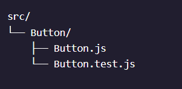

# Jest

#### What is Jest ?

Jest provides the two key ingredients needed for testing:

1. An assertion library: an API of functions for validating a program’s functionality
2. A test runner: a tool that executes tests and provides outputted test summaries


## Getting Started With Jest

Jest is the default test runner included and preconfigured in `create-react-app`. There is no further installation necessary when using `create-react-app` to build a new app!

To begin testing, we need to make sure that our test files are located, or match the following name conventions under the **/src** top-level directory:

- files with names ending in **.test.js**
- files with names ending in **.spec.js**
- **.js** files within a **__tests__/** directory

How we store test files in your project may depend on our specific needs. We may choose to colocate test files with the code being tested or to separate them into a **__tests__** directory.

File Structure usually recommended 



It is a good practice to match the name of the test file to the file that we want to test. For example, if we were to test a file called **math.js**, we might create a file called **math.test.js**.

Once we have our test files created , we can run the test using the npm command:

`npm test`

This will launch the test in *watch mode*, allowing the test to re-run every time the file is saved! We will need to type `q` in the terminal to quit out of the watch mode.

## Configuring Jest

Jest allows us to customize the terminal output using command-line flage , one of the most commonly used is the --coverage flag

`npm test -- --coverage`

Make sure to note the double dash between the `npm test` and `--coverage`. This is to separate the arguments from the test command itself. This `--coverage` flag allows us to get a report of which lines of our code were actually tested. In addition to being outputted in the terminal, this report becomes available in a directory named **coverage/** that is created at runtime.


This report can help us ensure our code has been thoroughly tested. From the report, we can see that there are four categories of our code that are being analyzed:

- **Statement** coverage analyzes the percentage of the program’s statements that have been executed.
- **Branch** coverage analyzes the percentage of the program’s edge cases that have been executed.
- **Function** coverage analyzes the percent of the program’s functions that have been called during testing.
- **Line** coverage analyzes the percentage of the program’s executable lines in the source file that have been executed.

## Unit Testing with Jest (Part 1)

A unit test is designed to test the smallest unit of your code, like a single function.

When unit testing, each function should be tested in isolation. We can do this by creating separate containers for our testing logic using the `it()` function or the `test()` function.

Functionally, `it()` and `test()` are the same. Using one over the other can make tests more readable. We should choose the one that organizationally makes sense in your project and use case.


```js
it("should render onto the screen",() => {});
test("should render onto the screen",() => {});
```

The `it()` function takes three arguments:

1. A string describing what is being tested.
2. A callback function containing assertions and other testing logic.
3. An optional timeout in milliseconds that specifies how long a test should wait before automatically aborting. If unspecified, this defaults to 5000 ms.

## Unit Testing with Jest(Part 2)

An assertion helps us define an expected outcome and check if the code meets these expectations

Jest helps us make assertions with the `expect()` function. It is used to assert the expected behavior of our program and is employed whenever we write a test. However, this function is rarely used alone — it can almost always be found in conjunction with *matcher methods* such as `.toBe()`.

Take a look at this example:

```js
expect(2+2).toBe(4)
```

The value passed to `expect()` should be an expression that you want to test (`2+2`), while the matcher method determines the validation method for that expression and its expected value (`.toBe(4)`).

`getIngredients()` converts an object containing ingredients and their quantities for a recipe into an array of just the ingredients.

```js
//file: recipes.test.js

// import the function to test
import { getIngredients } from "./recipes.js"; 

it("Gets only the ingredients list for Pesto", () => {
  //arrange
  const pestoRecipe = {
    'Basil': '2 cups',
    'Pine Nuts': '2 tablespoons',
    'Garlic': '2 cloves',
    'Olive Oil': '0.5 cups',
    'Grated Parmesan': '0.5 cups'
  }
  const expectedIngredients = ["Basil", "Pine Nuts", "Garlic", "Olive Oil", "Grated Parmesan"]

  //act
  const actualIngredients = getIngredients(pestoRecipe);

  //assert  
  expect(actualIngredients).toEqual(expectedIngredients)
});

```

In this example, we follow the *Arrange*, *Act*, *Assert* best practice testing pattern in the callback passed to `it()`:

- Arrange: In this stage, we set up the variables and conditions we need. We first declare the input (`pestoRecipe`) to be passed to the function being tested (`getIngredients()`) as well as the expected output (`expectedIngredients`).
- Act: In this stage, we invoke the functionality we want to test. We pass the input variable into the function being tested and store the result in a new variable (`actualIngredients`).
- Assert: In the last stage, we check if the code has produced the expected output. We use the `expect()` assertion function and the `.toEqual()` matcher to compare the values of the expected output with the actual output.

Multiple `expect()` assertions can be made within a single `it()` call. Regardless of the number of assertions made within a unit test, in order for the entire test to pass, all assertions must pass.

> Note: The `.toBe()` matcher is used to compare simple data types for equality, while the `.toEqual()` matcher is used for deep equality comparisons.

## Matcher Functions

We used the expect() assertion function along with the `.toEqual()` matcher method.Lets lookabout a few more common matcher methods 

```js
//file: recipes.test.js

// import the function to test
import { getIngredients } from "./recipes.js"; 

it("Gets only the ingredients list for Pesto", () => {
  //arrange
  const pestoRecipe = {
    'Basil': '2 cups',
    'Pine Nuts': '2 tablespoons',
    'Garlic': '2 cloves',
    'Olive Oil': '0.5 cups',
    'Grated Parmesan': '0.5 cups'
  };
  const expectedIngredients = ["Basil", "Pine Nuts", "Garlic", "Olive Oil", "Grated Parmesan"];

  //act
  const actualIngredients = getIngredients(pestoRecipe);

  //assert
  expect(actualIngredients).toBeDefined();
  expect(actualIngredients).toEqual(expectedIngredients);
  expect(actualIngredients.length).toBe(5);
  expect(actualIngredients[0] === "Basil").toBeTruthy();
  expect(actualIngredients).not.toContain("Ice Cream");
});

```

Let’s go over the matchers used in this example:

1. `.toBeDefined()` is used to verify that a variable is not `undefined`. This is often the first thing checked.
2. `.toEqual()` is used to perform deep equality checks between objects.
3. `.toBe()` is similar to .toEqual() but is used to compare primitive values.
4. `.toBeTruthy()` is used to verify whether a value is truthy or not.
5. `.not` is used before another matcher to verify that the opposite result is true
6. `.toContain()` is used when we want to verify that an item is in an array. In this case, since the `.not` matcher is used, we are verifying that `"Ice Cream"` is NOT in the array.
