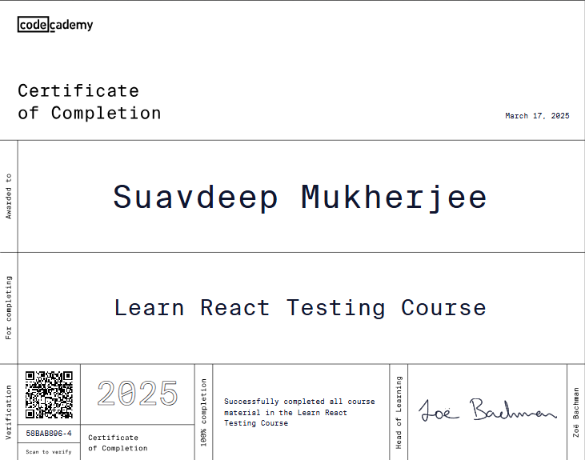

# Learn React Testing ⚛️🚀

🧪 This repository tracks my progress in Codecademy's **Learn React Testing** course.  
It includes my notes, exercises, and key takeaways as I dive into testing fundamentals and best practices for React applications.  

## 📖 Course Overview

The **Learn React Testing** course covers:  

✅ Jest

✅React Testing Library

---

## 🚀 Progress Tracker

| 📅 Date    | 📖 Lesson             | ✅ Status | 📝 Notes                                                                                                                        |
| ---------- | --------------------- | -------- | ------------------------------------------------------------------------------------------------------------------------------- |
| 2024-03-10 | Jest                  | ✅        | [Notes](https://github.com/SuvadeepMukherjee/Learn-React-Testing/blob/main/notes/Jest/Jest.MD)                                  |
| 2024-17-0  | React Testing Library | ✅        | [Notes](https://github.com/SuvadeepMukherjee/Learn-React-Testing/blob/main/notes/React-Testing-Library/react-testing-lbrary.md) |

---

## 📝 My Learning Goals

🎯 Master React testing fundamentals.  
🎯 Learn how to use Jest & React Testing Library effectively.  
🎯 Write unit and integration tests for React components.  
🎯 Document my journey & track progress.  
🎯 Gain confidence in writing robust, maintainable tests.  

---

🚀 Happy Testing! 🧪⚛️  

---

Certificate 

